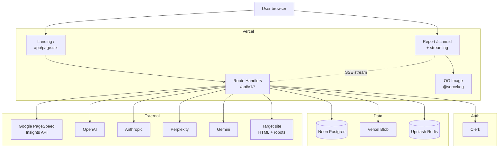
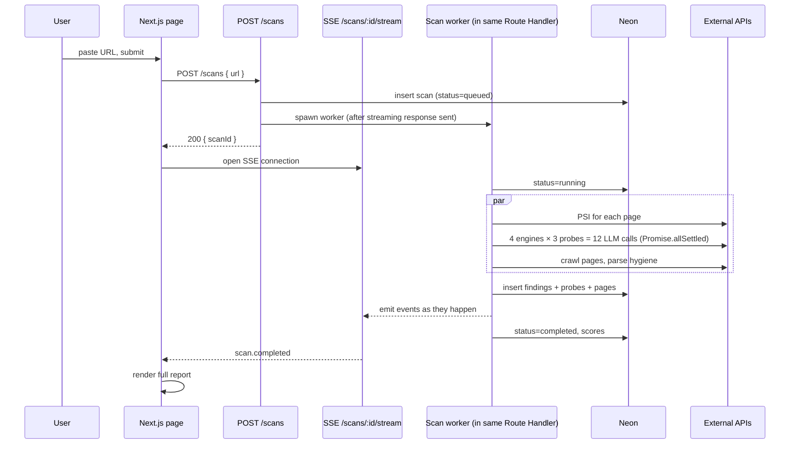

# Technical Spec: GEOlens v1

> Phase 5 of `/feature-pro`. Source of truth for Phase 6 implementation. Open decisions from PRD §15 are resolved here.

## 1. Architecture overview



## 2. Stack — locked

| Layer | Choice | Rationale (see ADRs) |
|---|---|---|
| Framework | Next.js 16 (App Router) + TypeScript strict | locked Phase 1 |
| UI | Tailwind CSS + shadcn/ui + Radix | locked Phase 4 |
| Type system | Fraunces + Inter + JetBrains Mono via `next/font` | locked Phase 4 |
| State (client) | TanStack Query + URL state | conventional |
| Form / validation | `react-hook-form` + Zod | conventional |
| Auth | Clerk | ADR-001 |
| Database | Neon Postgres + Drizzle ORM | ADR-002 |
| Blob storage | Vercel Blob (PDFs, OG snapshots) | ADR-002 |
| Cache / rate limiting | Upstash Redis | ADR-002 |
| AI SDK | `ai` (Vercel AI SDK) — provider-routed | ADR-003 |
| AI Gateway | Vercel AI Gateway — failover, cost cap | ADR-003 |
| Streaming | SSE via Route Handler + `streamText`/`streamObject` | ADR-003 |
| OG image | `@vercel/og` | locked Phase 4 |
| Analytics | Vercel Analytics + Vercel Web Vitals | conventional |
| Telemetry | Custom `events` table in Neon (no third-party in v1) | minimize vendors |
| HTML parsing | `cheerio` server-side | conventional |
| robots.txt parsing | `robots-parser` | conventional |
| Lighthouse | Google PageSpeed Insights API | locked Phase 1 |
| Deploy | Vercel (Pro plan required for 300s function timeout) | ADR-003 |

## 3. API surface — `/api/v1/*`

All routes are Next.js Route Handlers. Versioned `/api/v1/`. Zod-validated input. JSON in/out except SSE streams (`text/event-stream`).

### Public

| Method | Route | Purpose | Auth | Rate limit |
|---|---|---|---|---|
| `POST` | `/api/v1/scans` | Start scan; returns `{ scanId }` | optional | 2/IP/24h anon, 10/user/24h signed |
| `GET`  | `/api/v1/scans/:id/stream` | SSE stream of scan events | scanId-bound (anon ok) | n/a |
| `GET`  | `/api/v1/scans/:id` | Full scan JSON (gated to summary if anon) | optional | per-IP soft |
| `GET`  | `/api/v1/scans/:id/og` | OG image for share view | none | per-IP soft |
| `POST` | `/api/v1/waitlist` | Join fixer-agent waitlist | optional | 5/IP/h |
| `POST` | `/api/v1/share` | Create shareable URL for owned scan | required | 20/user/24h |
| `GET`  | `/share/:token` | Public read-only report (page, not API) | none | edge-cached |

### Authenticated

| Method | Route | Purpose |
|---|---|---|
| `GET`  | `/api/v1/me/scans` | List my scans (paginated) |
| `DELETE` | `/api/v1/scans/:id` | Delete my scan |
| `POST` | `/api/v1/scans/:id/pdf` | Start PDF export job; returns `{ jobId }` |
| `GET`  | `/api/v1/jobs/:id` | Poll PDF export status |

### Internal (cron / webhooks)

| Route | Purpose |
|---|---|
| `POST /api/internal/cleanup` | Vercel Cron: delete anonymous scans >30d, expire share tokens |
| `POST /api/internal/budget-check` | Vercel Cron (5-min): check daily LLM spend; trip global circuit breaker if over |

### SSE event schema (for `/scans/:id/stream`)

Each event is JSON. Discriminated by `type`:

```ts
type ScanEvent =
  | { type: 'crawl.started'; pages: string[] }
  | { type: 'crawl.page.fetched'; url: string; status: number; bytes: number }
  | { type: 'seo.psi.completed'; scores: { perf: number; a11y: number; bp: number; seo: number } }
  | { type: 'aeo.probe.started'; engine: Engine; probe: ProbeKind }
  | { type: 'aeo.probe.completed'; engine: Engine; probe: ProbeKind; result: ProbeResult }
  | { type: 'hygiene.checked'; checks: HygieneCheck[] }
  | { type: 'citability.computed'; metrics: CitabilityMetrics }
  | { type: 'scores.computed'; scoreSeo: number; scoreAeo: number; subscores: AeoSubscores }
  | { type: 'gaps.ranked'; topThree: Gap[]; allGaps: Gap[] }
  | { type: 'scan.completed'; durationMs: number; costCents: number }
  | { type: 'scan.failed'; stage: string; reason: string };
```

Frontend uses `EventSource` (or `fetch` + `ReadableStream` reader) to consume. Each event triggers a section render in the Direction A live-report layout.

## 4. Data schema — Neon Postgres

Drizzle schema. All tables include `created_at`, `updated_at`. Soft-delete via `deleted_at` on user-owned tables.

```ts
// users — Clerk-managed, mirror minimal fields here for FK targets
users {
  id            text PK             // Clerk user id
  email         text not null
  created_at    timestamptz default now()
}

scans {
  id            uuid PK default uuid_generate_v4()
  user_id       text FK -> users(id) nullable     // null = anonymous
  ip_hash       text not null                     // sha256(ip + salt) for rate limit
  url           text not null
  url_hash      text not null                     // sha256(canonicalize(url)) for dedupe
  hostname      text not null
  brand_name    text                              // inferred
  category      text                              // inferred
  status        text not null                     // queued|running|completed|failed
  stage         text                              // current scan stage
  score_seo     int
  score_aeo     int
  score_visibility int
  score_hygiene int
  score_citability int
  citation_rate_pct int
  sov_pct       int
  total_pages   int
  duration_ms   int
  cost_cents    int
  created_at    timestamptz default now()
  completed_at  timestamptz
  index (user_id, created_at desc)
  index (url_hash)                                // dedupe lookups
  index (ip_hash, created_at desc)                // rate limit
}

scan_findings {
  id            uuid PK
  scan_id       uuid FK -> scans(id) on delete cascade
  ord           int not null                      // 1, 2, 3... determines #GL-NN numbering
  category      text not null                    // seo|hygiene|engine|citability
  severity      text not null                    // critical|high|medium|low
  title         text not null
  why           text not null                    // plain-english
  detail        text                             // technical drill-down
  fix_hint      text
  effort        text                             // 30min|few-hours|days|weeks
  score_impact  int                              // estimated point lift
  is_top3       boolean default false
  meta          jsonb                            // arbitrary per-finding data
  created_at    timestamptz default now()
  index (scan_id, ord)
}

scan_engine_probes {
  id            uuid PK
  scan_id       uuid FK -> scans(id) on delete cascade
  engine        text not null                    // openai|anthropic|perplexity|gemini
  probe_kind    text not null                    // brand_recall|category_placement|citation_behavior
  prompt        text not null
  response      text                             // raw model output
  brand_mentioned boolean
  url_cited     boolean
  position      text                             // primary|secondary|tertiary|none
  sentiment     text                             // positive|neutral|negative
  accuracy      text                             // accurate|partial|misattributed
  base_score    int
  weighted_score int                             // after multipliers
  latency_ms    int
  cost_cents    int
  status        text not null                    // ok|skipped|errored
  error         text
  created_at    timestamptz default now()
  index (scan_id, engine, probe_kind)
}

scan_pages_crawled {
  id            uuid PK
  scan_id       uuid FK -> scans(id) on delete cascade
  url           text not null
  status_code   int
  bytes         int
  fetch_ms      int
  signals       jsonb                            // computed signals only, NOT raw HTML
  created_at    timestamptz default now()
  index (scan_id)
}

share_tokens {
  token         text PK                          // url-safe nanoid
  scan_id       uuid FK -> scans(id) on delete cascade
  created_by    text FK -> users(id)
  expires_at    timestamptz
  views         int default 0
  created_at    timestamptz default now()
}

waitlist_entries {
  id            uuid PK
  email         text not null
  scan_id       uuid FK -> scans(id) nullable
  gap_id        uuid FK -> scan_findings(id) nullable
  source        text                             // landing|gap_cta|share_view
  utm           jsonb
  created_at    timestamptz default now()
  unique (email, gap_id)
}

events {
  id            bigserial PK
  user_id       text nullable
  anon_id       text nullable
  event         text not null
  props         jsonb
  created_at    timestamptz default now()
  index (event, created_at desc)
}
```

Privacy guarantee from PRD §13: **never persist raw HTML** beyond scan duration. `scan_pages_crawled.signals` stores only computed metrics. Raw probe responses *are* persisted (for transparency / future fixer agent training) but are scoped to the `scan_id`.

## 5. Scan orchestration

### Lifecycle



### Implementation

Single Route Handler at `POST /api/v1/scans` accepts the URL, inserts a `scan` row, and **returns immediately** with `{ scanId }`. The actual scan work runs as a fire-and-forget async function spawned from the same handler. Vercel keeps the function alive until the spawned promise resolves or `maxDuration` (300s on Pro) expires.

The scan worker writes events to two places:
1. **Postgres** (`scans.stage`, plus rows in findings/probes/pages tables) — the durable record
2. **Upstash Redis pub/sub** (channel `scan:<id>`) — the live stream

The SSE endpoint at `GET /api/v1/scans/:id/stream` subscribes to the Redis channel and forwards events to the browser. This decouples the worker from connected clients (handles refresh, reconnect, multiple tabs) and keeps the worker durable: events still get written even if no client is listening.

### Concurrency & cost guards

- **Per-scan parallelism:** PSI + 4 engines × 3 probes + crawl all run via `Promise.allSettled`. Failures degrade gracefully; one engine outage doesn't fail the scan.
- **Per-engine timeout:** 25s per LLM call; 30s per PSI call. On timeout, mark probe `status=errored` and continue.
- **Daily global budget:** before each scan starts, the worker checks Redis key `geolens:spend:YYYY-MM-DD`. If above ceiling (default $50/day in v1), the scan completes with all engine probes skipped (status=skipped) and a banner appears in the report explaining the trip. Cron resets daily.
- **Per-scan cost ceiling:** $0.20 hard cap. If projected cost exceeds, drop to 1 probe per engine instead of 3.

### AI Gateway routing (Vercel AI Gateway)

We route all 4 engines through Vercel AI Gateway:
- Single API key + observability + retry policy
- Failover: if `gpt-4.1-mini` is rate-limited, retry against `gpt-4o-mini`
- Cost ceiling enforced per-key by Gateway
- Logs every probe response for debugging without polluting our app

If Gateway becomes a bottleneck or pricing changes, all 4 providers can be hit directly via the same `ai` SDK with one config flip.

## 6. Brand & category inference

Before the AEO probes run, we need a `brand_name` and `category` for the prompts.

**Heuristic order** (cheap → expensive):
1. Parse JSON-LD `Organization.name` and `WebSite.name` from homepage.
2. Parse `<meta property="og:site_name">` and `<title>` (strip everything after pipe / dash).
3. Extract category from JSON-LD `Organization.@type` or schema `Product.category`.
4. If still ambiguous, **one** LLM call: "Given this homepage HTML excerpt (first 4kb), what is the brand and what category of product/service?" — uses the cheapest model in the gateway. Cached by `url_hash` for 24h.

The user can override `brand_name` and `category` from the report UI ("Was this wrong? Re-run with corrected name").

## 7. Crawl strategy

- Submitted URL is the seed.
- Discover up to **5 internal pages** via `<a href>` from homepage that match the same hostname, ranked by:
  1. Sitemap presence (if `/sitemap.xml` exists, sample 5 most recent)
  2. Otherwise, top nav links
  3. Otherwise, body links
- Each fetch: max 10s, max 2MB, follow up to 3 redirects, respect `robots.txt` for `GEOlensBot/1.0`.
- Cache the rendered HTML in memory for the duration of the scan. Discard when scan ends.

## 8. Authentication flow

Clerk handles all auth UI. We use **Clerk's `<SignIn />` component in a modal** triggered by the locked-section overlay on the live report.

- After successful sign-in, the modal closes and the report unlocks in place (no full route change). The scan's `user_id` is updated to the now-known user via `PATCH /api/v1/scans/:id/claim` so anonymous-then-signed-in scans don't get orphaned.
- Clerk webhooks (`user.created`) sync minimal user data into our `users` table.
- All authenticated routes use Clerk's `auth()` helper for server-side checks.

## 9. Rate limiting

Upstash Redis with the `@upstash/ratelimit` package. Three windows:

| Key | Limit | Scope |
|---|---|---|
| `rl:scan:ip:<hash>` | 2 / 24h | anonymous scans |
| `rl:scan:user:<id>` | 10 / 24h | authenticated scans |
| `rl:waitlist:ip:<hash>` | 5 / 1h | waitlist signups |

`ip_hash` = `sha256(ip + IP_HASH_SALT)`. Salt rotates yearly. Never store plaintext IPs.

## 10. Telemetry

Events written to Neon `events` table (no third-party telemetry in v1). Backfilled to Vercel Analytics for the dashboard. Same event taxonomy as PRD §12, plus:

- `cost.scan` (cost_cents, model, scan_id) — for budget dashboards
- `error.api` (route, code, scan_id) — for error tracking

## 11. Methodology page

A dedicated `/methodology` route, editorial-styled (Direction C), explains the scoring formula end-to-end with worked examples. This is brand-defining: every shared report links here, and our scoring is open-faced.

## 12. Testing strategy (preview Phase 8)

- **Unit**: scoring formulas, brand inference, hygiene checks (Vitest)
- **Integration**: Route Handlers via `@testing-library`, mocked external APIs
- **E2E**: Playwright — submit a real URL, verify streaming events, sign-in flow, share view
- **Snapshot**: rendered OG images
- **Cost regression test**: a fixed-seed scan must come in under $0.20

## 13. Performance budgets

| Surface | Budget |
|---|---|
| Landing LCP (mobile 4G) | <1.8s |
| Landing CLS | <0.05 |
| Time-to-first-event after submit | <2s p95 |
| Full scan (URL → completed) | <90s p95, <120s p99 |
| Report initial JS bundle | <140kb gzip |

## 14. Environment variables

```
# Vercel
VERCEL_ENV
NEXT_PUBLIC_SITE_URL

# Auth
CLERK_PUBLISHABLE_KEY
CLERK_SECRET_KEY
CLERK_WEBHOOK_SIGNING_SECRET

# Database
DATABASE_URL (Neon)
DIRECT_URL (Neon, for migrations)

# Cache
UPSTASH_REDIS_REST_URL
UPSTASH_REDIS_REST_TOKEN

# Blob
BLOB_READ_WRITE_TOKEN

# AI
AI_GATEWAY_API_KEY
# Provider keys held by Gateway, not directly here
PAGESPEED_INSIGHTS_API_KEY

# App secrets
IP_HASH_SALT          # rotate yearly
SHARE_TOKEN_SECRET

# Limits (overridable per-env)
DAILY_LLM_BUDGET_USD   # default 50
PER_SCAN_COST_CEILING_CENTS # default 20
```

## 15. Out of v1 scope (explicit)

- Vercel Workflow durable agent for fixer (deferred)
- Continuous monitoring / cron rescans
- Multi-region writes (Neon single-region is fine for v1)
- Custom-domain share URLs
- Webhook integrations (Slack, etc.)
- Public API for third parties

## 16. Definition of done for spec

- [ ] All decisions in PRD §15 resolved (see ADRs)
- [ ] Every route in §3 has a Zod schema and an OpenAPI snippet (Phase 6 deliverable)
- [ ] Drizzle migration files generated for §4 schema (Phase 6 deliverable)
- [ ] Cost ceiling test in §12 lands before merge to main

References: see `adrs/adr-001-auth.md`, `adrs/adr-002-data-storage.md`, `adrs/adr-003-scan-orchestration.md`.
